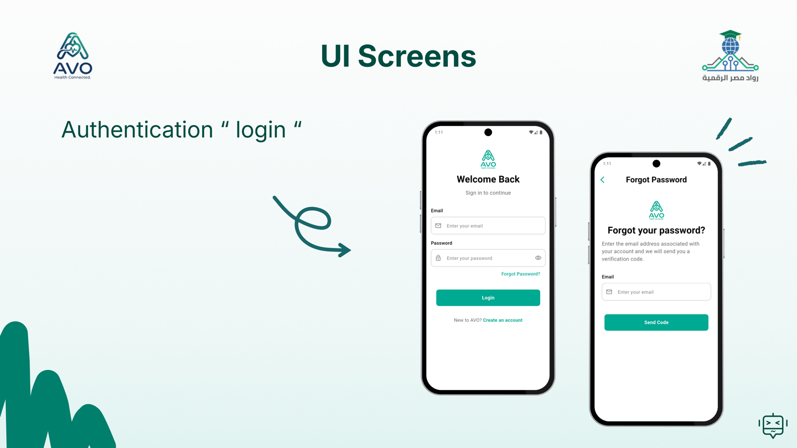
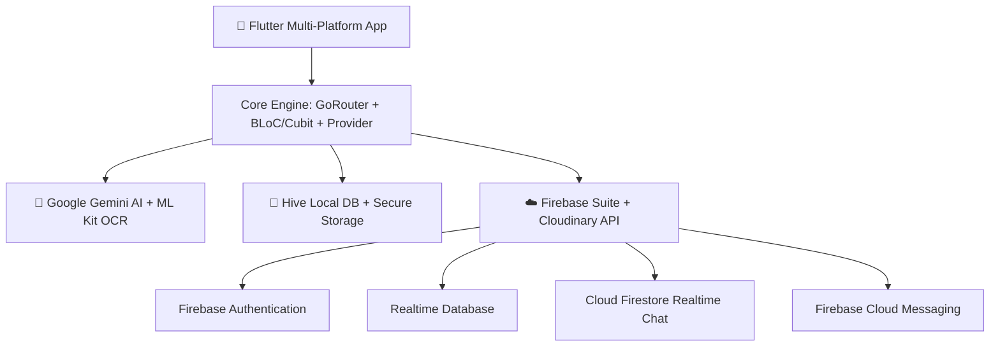

<div align="center">

  

  # 🏥 AVO HealthCare Ecosystem
  ### The All-in-One Smart Digital Health, AI Medical Assistant & Teleconsultation Platform

  <p align="center">
    <b>A graduation project developed under the Digital Egypt Pioneers Initiative (DEPI)</b>
  </p>

  <!-- Badges -->
  <p align="center">
    <a href="https://flutter.dev"></a>
    <a href="https://dart.dev"></a>
    <a href="https://firebase.google.com"></a>
    <a href="https://ai.google.dev"></a>
    <a href="https://yehiaelrify1.github.io/project-tylda/"></a>
    
  </p>

  <p align="center">
    <a href="https://yehiaelrify1.github.io/project-tylda/"><strong>Explore Live Web Showcase »</strong></a>
    <br />
    <br />
    <a href="#-key-features">Key Features</a> •
    <a href="#-multi-role-portals">Multi-Role Portals</a> •
    <a href="#-system-architecture--diagrams">Architecture & Diagrams</a> •
    <a href="#-tech-stack">Tech Stack</a> •
    <a href="#-getting-started">Getting Started</a> •
    <a href="#-the-team">The Team</a>
  </p>

  <br />

  

</div>

---

## 🌟 Overview

**AVO HealthCare** is a next-generation healthcare application engineered with **Flutter** and modern cloud infrastructure. It bridges the communication and workflow gaps between **Patients**, **Doctors**, **Pharmacies**, and **Administrators** through:

- **AI-Powered Diagnostics**: Real-time optical character recognition (OCR) of medical prescriptions and lab reports powered by **Google ML Kit** and **Gemini AI**.
- **Smart Medication Adherence**: Interactive daily schedule tracking with local and push notifications via **Hive** and **Awesome Notifications**.
- **Encrypted Telehealth Consultations**: Direct in-app messaging, active presence tracking, and appointment management backed by **Cloud Firestore** and **Firebase RTDB**.
- **3D Animated Payment Processing**: Frictionless checkout and payment method management featuring interactive 3D card flipping animations.
- **Universal Accessibility**: Seamless bilingual localization (**English & Arabic**) with automatic RTL adaptation and adaptive **Dark/Light** design tokens.

---

## 📱 Multi-Role Portals

AVO HealthCare provides tailor-made dashboards and specialized toolsets for every participant in the medical ecosystem:

| 👤 Patient Portal | 👨‍⚕️ Doctor Portal | 💊 Pharmacy Portal | 🛡️ Admin Portal |
| :--- | :--- | :--- | :--- |
| • Instant Doctor Booking<br/>• Prescription Scanner & AI<br/>• Medication Reminders<br/>• Health Metrics & Logs<br/>• Order Pharmacy Items | • Schedule & Slot Builder<br/>• Patient Queue Management<br/>• Prescription Dispatch<br/>• Performance Analytics<br/>• Rating & Review Tracker | • Incoming Order Pipeline<br/>• Prescription Validation<br/>• Inventory & Fulfillment<br/>• Sales & Metric Reports<br/>• Direct Patient Chat | • Role Approvals & Verification<br/>• Real-time Audit Logs<br/>• System-wide User Moderation<br/>• Security & Permission Rules |

<div align="center">
  
</div>

---

## ✨ Key Features

### 1. 🤖 AI Prescription & Lab Analysis
Users can photograph physical prescriptions or laboratory test results. The app utilizes on-device **Google ML Kit OCR** to extract the text, which is then processed through **Google Gemini AI** to structure medications, identify dosages, check for interactions, and generate layperson-friendly medical summaries stored offline in **Hive**.

### 2. ⏰ Smart Medication Reminder & Adherence Reports
- Dynamic timeline visualizing daily doses (Morning, Afternoon, Evening, Bedtime).
- One-tap status updates (`Taken`, `Skipped`, `Snoozed`).
- Adherence calculation producing monthly compliance charts via `fl_chart`.
- Background notification scheduling that works completely offline.

### 3. 💬 Real-Time Consultations & Presence
- End-to-end encrypted messaging channels between verified patients and doctors.
- Live user presence (`online`, `offline`, `last seen`) and typing indicators.
- Voice calls and image/document attachments uploaded via secure **Cloudinary** storage.

### 4. 💳 Advanced Checkout & 3D Interactive Cards
- Add and manage payment methods with smooth **3D Card Flip** animations rendering front details and CVV security codes.
- Supports digital wallets, credit/debit cards, and cash on delivery.

### 5. 🌍 Enterprise Localization & Adaptive Theming
- Strict zero-hardcoding policy: 100% of UI strings are mapped through `easy_localization` in **Arabic** and **English**.
- Real-time **Dark/Light Mode** switching with persistent preference caching.

---

## 📐 System Architecture & Diagrams

AVO HealthCare was designed following rigorous software engineering standards and Clean Architecture principles:

### 🔄 Context Level Data Flow Diagram (DFD Level 0)
<div align="center">
  
</div>

### 🧩 Detailed System Data Flow (DFD Level 1)
<div align="center">
  
</div>

### 👥 System Use Case Diagram
<div align="center">
  
</div>

### 🏗️ Domain Class & Entity Model
<div align="center">
  
</div>

### ⚙️ Component & Service Architecture
<div align="center">
  
</div>

---

## 🛠️ Tech Stack & Ecosystem



### Frameworks & Libraries
| Category | Technology | Purpose |
| :--- | :--- | :--- |
| **Core Framework** | Flutter 3.3+ & Dart 3.0+ | Cross-platform mobile runtime (iOS, Android, Web) |
| **State Management** | `flutter_bloc` (Cubit) + `Provider` | Reactive, testable, and isolated UI state management |
| **Navigation** | `go_router` | Declarative routing with `ShellRoute` nested navigation |
| **Backend & Cloud** | Firebase (Auth, RTDB, Firestore, FCM) | User identity, real-time database, live chat, and push alerts |
| **Artificial Intelligence** | `google_generative_ai` + `google_mlkit_text_recognition` | On-device prescription OCR and Gemini AI medical assistant |
| **Local Persistence** | `hive_flutter` + `flutter_secure_storage` | Offline medical analysis history, metrics, and token storage |
| **Media & Storage** | `cloudinary_api` & `image_picker` | Cloud asset upload and secure media storage |
| **Localization & Theme** | `easy_localization` & `flutter_screenutil` | Bilingual Arabic/English support and responsive pixel-scaling |
| **Showcase Website** | Vanilla HTML5, CSS3 Tokens, MVVM JavaScript | Zero-dependency high-speed web landing page & live demo |

---

## 📁 Repository Structure

```text
project-tylda/
├── .github/workflows/         # Automated GitHub Actions deployment for Pages
├── assets/                    # App assets (imgs, svg, icons, animations, translations)
│   ├── animations/            # Lottie animation assets
│   ├── imgs/                  # Application graphics & photography
│   ├── svg/                   # Scalable vector graphics
│   └── translations/          # ar.json and en.json translation catalogs
├── avo_website/               # Interactive Showcase Website & Landing Page
│   ├── assets/                # Architectural diagrams, team photos, screen mocks
│   ├── css/                   # Modular design system (tokens, components, utilities)
│   ├── js/                    # Vanilla JS MVVM architecture
│   └── index.html             # Showcase landing page
├── lib/                       # Flutter Application Root
│   ├── app/
│   │   ├── core/              # Cross-cutting concerns (Theme, Router, Services, Utils)
│   │   └── features/          # 21 Feature-First business modules:
│   │       ├── auth/          # Authentication & onboarding
│   │       ├── home/          # Patient overview dashboard
│   │       ├── doctor/        # Doctor appointment & schedule portal
│   │       ├── pharmacy/      # Pharmacy fulfillment & orders
│   │       ├── admin/         # Admin moderation & approvals
│   │       ├── scanner/       # ML Kit OCR & Gemini AI analysis
│   │       ├── reminder/      # Medication logs & adherence
│   │       ├── chats/         # Realtime Firestore consultations
│   │       └── payment/       # 3D interactive card & checkout
│   ├── firebase_options.dart  # Firebase platform configuration
│   ├── main.dart              # App bootstrap & service initialization
│   └── my_app.dart            # MultiProvider root & theme configuration
└── test/                      # Unit, mock, and widget test suites
```

---

## 🚀 Getting Started

### Prerequisites
- [Flutter SDK](https://flutter.dev/docs/get-started/install) (`^3.3.0` or higher)
- [Dart SDK](https://dart.dev/get-dart) (`^3.3.0`)
- Android Studio / Xcode for device simulation
- A valid Firebase Project and Google Gemini API key

### 1. Clone the Repository
```bash
git clone https://github.com/YehiaElrify1/project-tylda.git
cd project-tylda
```

### 2. Install Dependencies
```bash
flutter pub get
```

### 3. Configure Environment Variables
Create a `.env` file in the root directory:
```env
GEMINI_API_KEY=your_gemini_api_key_here
CLOUDINARY_CLOUD_NAME=your_cloud_name
CLOUDINARY_API_KEY=your_api_key
CLOUDINARY_API_SECRET=your_api_secret
```

### 4. Run Code Generation (Hive & Localization)
```bash
flutter pub run build_runner build --delete-conflicting-outputs
```

### 5. Launch the Application
```bash
# Run on connected mobile device or emulator
flutter run
```

---

## 👥 Meet the Team

This project was built and delivered with pride by the **AVO Development Team** under the **Digital Egypt Pioneers Initiative (DEPI)**:

<div align="center">
  <table>
    <tr>
      <td align="center" width="16.6%">
        <br />
        <sub><b>Yehia Mahmoud</b></sub><br />
        <sub>Mobile & Frontend Lead</sub>
      </td>
      <td align="center" width="16.6%">
        <br />
        <sub><b>Mamdouh Salah</b></sub><br />
        <sub>Flutter Developer</sub>
      </td>
      <td align="center" width="16.6%">
        <br />
        <sub><b>Ziad Magdy</b></sub><br />
        <sub>Flutter Developer</sub>
      </td>
      <td align="center" width="16.6%">
        <br />
        <sub><b>Abdelrhman Saleh</b></sub><br />
        <sub>Flutter Developer</sub>
      </td>
      <td align="center" width="16.6%">
        <br />
        <sub><b>Rehab Hatem</b></sub><br />
        <sub>UI/UX & Mobile Dev</sub>
      </td>
      <td align="center" width="16.6%">
        <br />
        <sub><b>Eng. Ibrahim Saad</b></sub><br />
        <sub>Project Supervisor</sub>
      </td>
    </tr>
  </table>
</div>

---

## 📄 License & Acknowledgments

- **Program**: Digital Egypt Pioneers Initiative (DEPI) — Ministry of Communications and Information Technology (MCIT), Egypt.
- **Supervision**: Special thanks to **Eng. Ibrahim Saad** for architectural guidance and mentorship throughout the project lifecycle.
- **License**: Distributed under the [MIT License](LICENSE).

<div align="center">
  <sub>Built with ❤️ for a healthier and smarter tomorrow.</sub>
</div>
