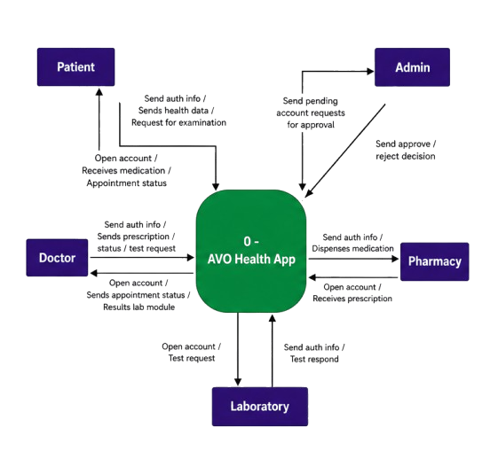
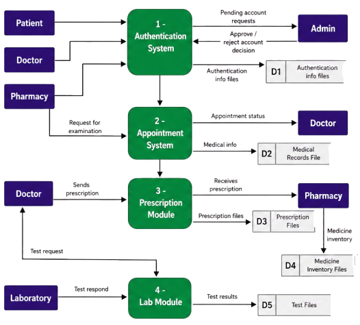
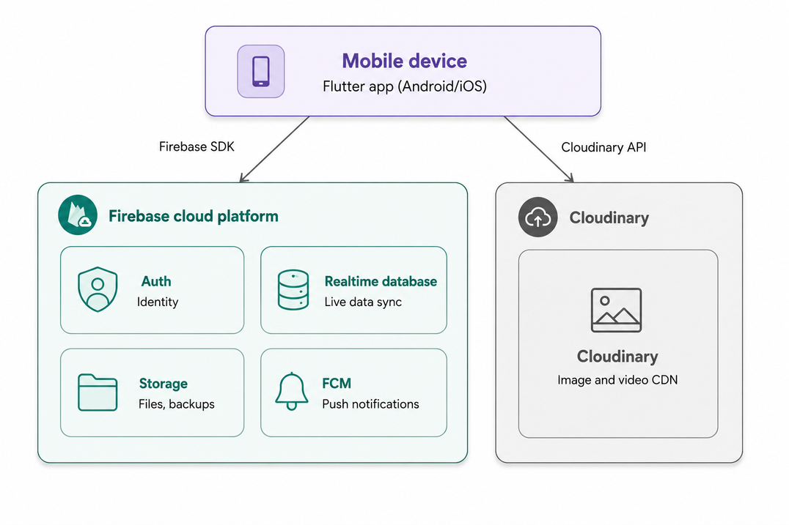
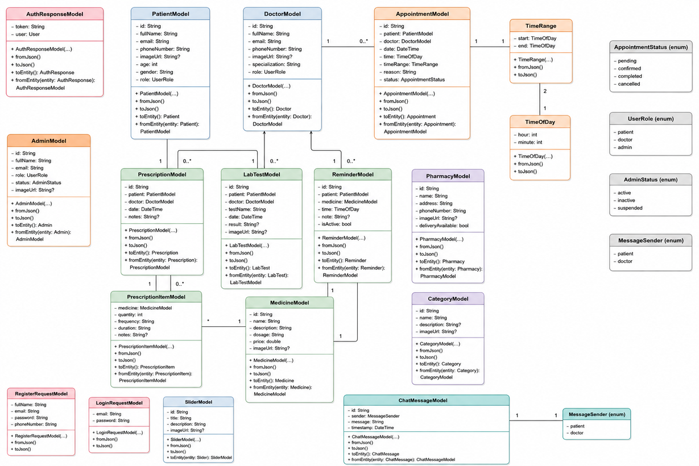
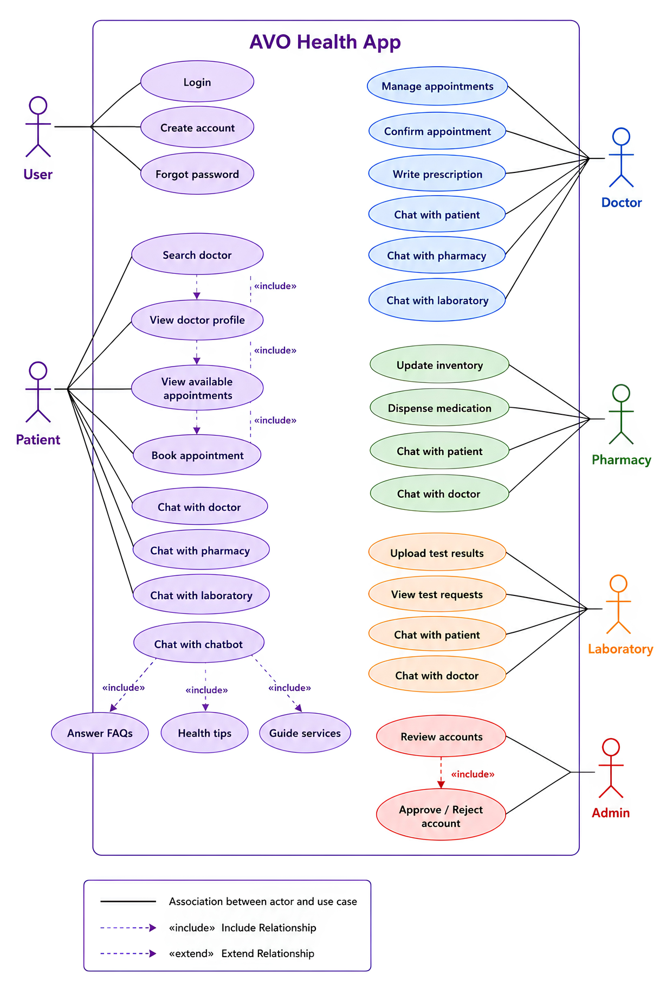

<div align="center">

  

  # AVO HealthCare — Technical Architecture & Engineering Documentation

  <p align="center">
    <b>A Multi-Role Telemedicine, AI Diagnostics & Health Operations Platform</b><br/>
    <i>Built with Flutter, Feature-First Clean Architecture, BLoC/Cubit, Firebase RTDB/Firestore, and Google Gemini AI</i>
  </p>

  <!-- Technical Badges -->
  <p align="center">
    <a href="https://flutter.dev"></a>
    <a href="https://dart.dev"></a>
    
    
    <a href="https://firebase.google.com"></a>
    <a href="https://ai.google.dev"></a>
    <a href="https://yehiaelrify1.github.io/project-tylda/"></a>
  </p>

  <p align="center">
    <a href="#-architectural-patterns--system-design">System Design</a> •
    <a href="#-uml--data-flow-specifications">UML & DFD Specs</a> •
    <a href="#-deep-dive-technical-modules">Technical Modules</a> •
    <a href="#-data-synchronization--hybrid-database-topology">Database Topology</a> •
    <a href="#-codebase-structure">Codebase Structure</a> •
    <a href="#-developer-setup--tooling">Developer Setup</a>
  </p>

</div>

---

## 🏛️ Architectural Patterns & System Design

The application adheres strictly to **Feature-First Clean Architecture**, enforcing domain boundary separation, dependency inversion, and testability across 21 autonomous modules.

```
┌─────────────────────────────────────────────────────────────────────────┐
│                           PRESENTATION LAYER                            │
│  ┌─────────────────────────┐            ┌────────────────────────────┐  │
│  │   UI Screens & Widgets  │ ◄───────── │   BLoC / Cubit Controllers │  │
│  │ (Stateless + ScreenUtil)│ (Re-render)│ (Pure Business & UI State) │  │
│  └─────────────────────────┘            └─────────────┬──────────────┘  │
└───────────────────────────────────────────────────────┼─────────────────┘
                                                        │ Calls UseCases / Contract
┌───────────────────────────────────────────────────────┼─────────────────┐
│                              DOMAIN LAYER             ▼                 │
│  ┌───────────────────────────────────────────────────────────────────┐  │
│  │                   Repository Interfaces / Contracts               │  │
│  │                     (e.g., DoctorRepository)                      │  │
│  └────────────────────────────────────▲──────────────────────────────┘  │
└───────────────────────────────────────┼─────────────────────────────────┘
                                        │ Implements Interface
┌───────────────────────────────────────┼─────────────────────────────────┐
│                               DATA LAYER                                │
│  ┌────────────────────────────────────┴──────────────────────────────┐  │
│  │                    Repository Implementation                      │  │
│  │                   (e.g., DoctorRepositoryImpl)                    │  │
│  └───────────────┬───────────────────────────────────┬───────────────┘  │
│                  ▼                                   ▼                  │
│   ┌─────────────────────────────┐     ┌─────────────────────────────┐   │
│   │    Remote Data Source       │     │     Local Data Source       │   │
│   │ (Firebase RTDB, Firestore,  │     │ (Hive Box, Encrypted Prefs, │   │
│   │  Dio HTTP, Gemini AI API)   │     │   Secure Token Storage)     │   │
│   └─────────────────────────────┘     └─────────────────────────────┘   │
└─────────────────────────────────────────────────────────────────────────┘
```

### Key Engineering Invariants
1. **Stateless UI Boundary**: Screens and widgets remain purely declarative. UI states, form controllers (`TextEditingController`), input validation rules, and async operations are isolated inside their respective `Cubit` instances.
2. **Dependency Injection**: Services, repositories, and API clients are managed as singletons or factories registered in a central service locator container (`service_locator.dart`).
3. **Decoupled Navigation**: Routes are decoupled using `GoRouter` declarative routing. Multi-tab navigation preserves state using `StatefulShellRoute` and persistent tab indices without rebuilding widget subtrees.

---

## 📐 UML & Data Flow Specifications

### 1. Context-Level Data Flow (DFD Level 0)
Illustrates system interactions between external entities (**Patient**, **Doctor**, **Pharmacy**, **Admin**) and the central AVO platform runtime.

<div align="center">
  <table style="background-color: #ffffff; border-radius: 10px; padding: 12px; border: 1px solid #e1e4e8;">
    <tr>
      <td align="center" style="background-color: #ffffff;">
        
      </td>
    </tr>
  </table>
</div>

---

### 2. Decomposed Subsystem Data Flow (DFD Level 1)
Details internal subsystem processes, data stores, and event streams for authentication, appointment scheduling, OCR prescription parsing, and billing.

<div align="center">
  <table style="background-color: #ffffff; border-radius: 10px; padding: 12px; border: 1px solid #e1e4e8;">
    <tr>
      <td align="center" style="background-color: #ffffff;">
        
      </td>
    </tr>
  </table>
</div>

---

### 3. Component & Service Architecture
Maps out runtime modular components, microservices, local storage partitions, and third-party cloud integrations.

<div align="center">
  <table style="background-color: #ffffff; border-radius: 10px; padding: 12px; border: 1px solid #e1e4e8;">
    <tr>
      <td align="center" style="background-color: #ffffff;">
        
      </td>
    </tr>
  </table>
</div>

---

### 4. Domain Entity & Class Hierarchy
Class definitions, inheritance structures, model attributes, and business methods.

<div align="center">
  <table style="background-color: #ffffff; border-radius: 10px; padding: 12px; border: 1px solid #e1e4e8;">
    <tr>
      <td align="center" style="background-color: #ffffff;">
        
      </td>
    </tr>
  </table>
</div>

---

### 5. Multi-Role Use Case Model
Permission matrix and functional boundaries for Patient, Doctor, Pharmacist, and Administrator actors.

<div align="center">
  <table style="background-color: #ffffff; border-radius: 10px; padding: 12px; border: 1px solid #e1e4e8;">
    <tr>
      <td align="center" style="background-color: #ffffff;">
        
      </td>
    </tr>
  </table>
</div>

---

## 🔬 Deep-Dive Technical Modules

### 1. 🤖 AI Prescription & Lab Report OCR Pipeline
The scanner module converts physical prescriptions and diagnostic lab sheets into structured medical data:

```
[Camera / Gallery Image]
         │
         ▼
[Google ML Kit Text Recognition]  ──> (Raw extracted text buffer)
         │
         ▼
[Gemini Generative AI Pipeline]   ──> (Structured JSON Prompting)
         │
         ├── Extracted Drug Names & Dosages
         ├── Administration Schedule (Morning / Noon / Night)
         ├── Clinical Warnings & Interactions
         └── Layperson Summary
         │
         ▼
[Hive Local Storage Box]          ──> (Persistent Offline History)
```

- **On-Device OCR**: `google_mlkit_text_recognition` parses script tokens on-device without remote roundtrips.
- **LLM Normalization**: Extracted tokens are dispatched to `google_generative_ai` (Gemini Flash model) with strict JSON schema constraints.
- **Offline Caching**: Processed reports are serialized into binary `Hive` boxes (`HiveType(typeId: X)`) for instant offline lookup.

---

### 2. ⚡ Real-Time Consultation & Presence Engine
Engineered on **Cloud Firestore** and **Firebase Realtime Database (RTDB)** for low-latency doctor-patient messaging:

```dart
// Presence tracking implementation using RTDB onDisconnect hooks
final userStatusDatabaseRef = FirebaseDatabase.instance.ref('/status/$userId');
final connectedRef = FirebaseDatabase.instance.ref('.info/connected');

connectedRef.onValue.listen((event) {
  final isConnected = event.snapshot.value as bool? ?? false;
  if (isConnected) {
    userStatusDatabaseRef.onDisconnect().set({
      'state': 'offline',
      'last_changed': ServerValue.timestamp,
    });
    userStatusDatabaseRef.set({
      'state': 'online',
      'last_changed': ServerValue.timestamp,
    });
  }
});
```

- **Dual-Database Strategy**:
  - **Firestore**: Relational document storage for structured chat logs, media metadata, consultation threads, and security rules.
  - **RTDB**: Lightweight key-value store for ephemeral states, live typing indicators, and socket disconnection triggers.
- **Media Upload**: Encrypted image and audio attachments are streamed to Cloudinary with secure hash signatures.

---

### 3. ⏰ Medication Adherence & Background Notification Pipeline
- **Scheduling**: Time-slot calculations compute exact minute offsets (`hour * 60 + minute`) avoiding timezone drift.
- **Background Dispatch**: `awesome_notifications` schedules OS-level alarms with precise alarms permission (`SCHEDULE_EXACT_ALARM`).
- **Adherence Computation**: Daily dose statuses (`Taken`, `Skipped`, `Snoozed`) trigger reactive adherence rate calculations visualized via `fl_chart`.

---

### 4. 💳 3D Interactive Card Animation & Checkout Architecture
- **Matrix Transformation**: Uses `Transform` with `Matrix4.identity()..setEntry(3, 2, 0.001)..rotateY(angle)` to execute realistic 3D perspective card flips when toggling between Front details (Card number, Expiry, Name) and Back details (CVV code).
- **Payment Method Pattern**: Encapsulates multiple payment gateways (Credit Card, PayPal, Apple Pay, Cash on Delivery) under a unified `PaymentStrategy` contract.

---

## 🗄️ Data Synchronization & Hybrid Database Topology

```
                  ┌──────────────────────────────┐
                  │    AVO Flutter Client        │
                  └──────────────┬───────────────┘
                                 │
         ┌───────────────────────┼───────────────────────┐
         │                       │                       │
         ▼                       ▼                       ▼
┌─────────────────┐     ┌─────────────────┐     ┌─────────────────┐
│  Firebase RTDB  │     │ Cloud Firestore │     │  Hive Local DB  │
├─────────────────┤     ├─────────────────┤     ├─────────────────┤
│ • Presence      │     │ • Encrypted Chat│     │ • Offline Cache │
│ • Live Queues   │     │ • Consultations │     │ • Prescriptions │
│ • Doctor Slots  │     │ • User Profiles │     │ • Adherence Logs│
│ • Realtime Logs │     │ • Order Records │     │ • Auth Tokens   │
└─────────────────┘     └─────────────────┘     └─────────────────┘
```

---

## 📂 Codebase Structure

```
project-tylda/
├── .github/workflows/
│   └── deploy-pages.yml               # Automated CI/CD for GitHub Pages
├── assets/
│   ├── animations/                    # Lottie vector animation JSON files
│   ├── imgs/                          # Static image assets categorized by domain
│   ├── svg/                           # Scalable vector graphics (SVGs)
│   └── translations/                  # JSON localization catalogs (ar.json, en.json)
├── avo_website/                       # Lightweight Vanilla JS MVVM Showcase Web App
│   ├── assets/                        # Diagrams, screen captures, team assets
│   ├── css/                           # Design tokens, components, utility stylesheets
│   ├── js/                            # Core engine, Models, ViewModels, UI Views
│   └── index.html                     # Web showcase entry point
├── lib/
│   ├── app/
│   │   ├── core/                      # Global infrastructure & cross-cutting concerns
│   │   │   ├── constants/             # Design tokens, colors, asset path constants
│   │   │   ├── error/                 # Failure models & exception handlers
│   │   │   ├── Language/              # Localization codegen & LocaleKeys
│   │   │   ├── models/                # Core domain transfer objects
│   │   │   ├── network/               # Centralized Dio HTTP client & interceptors
│   │   │   ├── router/                # GoRouter declarations & route guards
│   │   │   ├── services/              # Notification, Hive, and Service Locator DI
│   │   │   ├── theme/                 # Light/Dark ThemeData specifications
│   │   │   └── utils/                 # Date helpers, validators, screen extensions
│   │   └── features/                  # 21 Feature-First Domain Modules:
│   │       ├── admin/                 # Role approvals, system audits, user moderation
│   │       ├── appointment/           # Booking pipeline & slot management
│   │       ├── auth/                  # Firebase Auth, JWT handling, role checks
│   │       ├── book_patient/          # Patient intake & triage flow
│   │       ├── chatbot/               # Conversational AI triage
│   │       ├── chats/                 # Realtime consultation rooms & presence
│   │       ├── doctor/                # Doctor dashboard, queues, schedule builder
│   │       ├── favorites/             # Bookmarked doctors & clinics
│   │       ├── home/                  # Multi-role home dashboards
│   │       ├── notification/          # FCM push handler & local notifications
│   │       ├── onboard/               # Walkthrough carousel & role selector
│   │       ├── payment/               # 3D credit card animation & checkout
│   │       ├── pharmacy/              # Prescription validation & fulfillment
│   │       ├── profile/               # Health metrics, biometrics, preferences
│   │       ├── reminder/              # Medication alarms & adherence tracking
│   │       └── scanner/               # Google ML Kit OCR & Gemini AI analysis
│   ├── firebase_options.dart          # Code-generated Firebase configuration
│   ├── main.dart                      # App entry point, DI bootstrap, Hive registration
│   └── my_app.dart                    # MaterialApp.router, MultiProvider, Theme setup
├── test/                              # Unit, widget, and bloc test suites
├── analysis_options.yaml              # Dart analyzer & linter configuration
├── firebase.json                      # Firebase CLI configuration
└── pubspec.yaml                       # Package dependencies & asset declarations
```

---

## 🛠️ Developer Setup & Tooling

### Prerequisites
- **Flutter SDK**: `>=3.3.0`
- **Dart SDK**: `>=3.0.0`
- **CocoaPods** (for iOS builds): `>=1.11.0`
- **Android Gradle Plugin**: `8.0+` with JDK 17

### 1. Repository Setup
```bash
git clone https://github.com/YehiaElrify1/project-tylda.git
cd project-tylda
flutter pub get
```

### 2. Environment Variables Configuration
Configure environment variables using Dart compile-time defines (`--dart-define`):
```bash
flutter run \
  --dart-define=GEMINI_API_KEY=YOUR_GEMINI_KEY \
  --dart-define=CLOUDINARY_CLOUD_NAME=YOUR_CLOUD_NAME \
  --dart-define=CLOUDINARY_API_KEY=YOUR_API_KEY \
  --dart-define=CLOUDINARY_API_SECRET=YOUR_API_SECRET
```

### 3. Code Generation (Hive Adapters & Translations)
Execute `build_runner` to generate `TypeAdapters` and `locale_keys.g.dart`:
```bash
flutter pub run build_runner build --delete-conflicting-outputs
```

### 4. Code Quality & Static Analysis
Run the static analyzer to ensure compliance with `flutter_lints`:
```bash
flutter analyze
flutter test
```

---

## 👥 Engineering Team & Acknowledgments

This platform was engineered and delivered under the **Digital Egypt Pioneers Initiative (DEPI)**, supervised by the **Ministry of Communications and Information Technology (MCIT)**, Egypt.

<div align="center">
  <table>
    <tr>
      <td align="center" width="16.6%">
        <br />
        <sub><b>Yehia Mahmoud</b></sub><br />
        <sub>Mobile & Core Lead</sub>
      </td>
      <td align="center" width="16.6%">
        <br />
        <sub><b>Mamdouh Salah</b></sub><br />
        <sub>Flutter Developer</sub>
      </td>
      <td align="center" width="16.6%">
        <br />
        <sub><b>Ziad Magdy</b></sub><br />
        <sub>Flutter Developer</sub>
      </td>
      <td align="center" width="16.6%">
        <br />
        <sub><b>Abdelrhman Saleh</b></sub><br />
        <sub>Flutter Developer</sub>
      </td>
      <td align="center" width="16.6%">
        <br />
        <sub><b>Rehab Hatem</b></sub><br />
        <sub>UI/UX & Mobile Dev</sub>
      </td>
      <td align="center" width="16.6%">
        <br />
        <sub><b>Eng. Ibrahim Saad</b></sub><br />
        <sub>Project Supervisor</sub>
      </td>
    </tr>
  </table>
</div>

---

<div align="center">
  <sub>AVO HealthCare • Licensed under the MIT License</sub>
</div>
