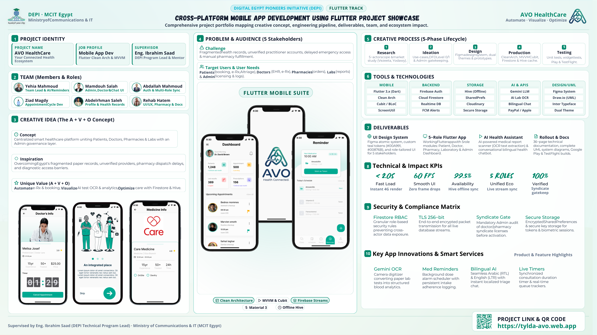

# 📊 AVO HealthCare — Project Showcase Infographic

> **Digital Egypt Pioneers Initiative (DEPI) — Flutter Track**  
> Cross-Platform Mobile App Development Using Flutter  
> **Project:** AVO HealthCare (Automate · Visualize · Optimize)

---

## 🖼️ Showcase Infographic

  

  <em>👆 Click the image above to open and download the original <b>High-Resolution PDF (Infogragh.pdf)</b></em>

---

## 📑 Asset Links

- 📄 **Full High-Resolution PDF:** [`Infogragh.pdf`](./Infogragh.pdf)
- 🖼️ **Lossless PNG Infographic:** [`Infogragh.png`](./Infogragh.png)
- 🌐 **Live Web Platform:** [tylda-avo.web.app](https://tylda-avo.web.app)
- 📱 **Mobile App Package:** `com.tylda.avo`
